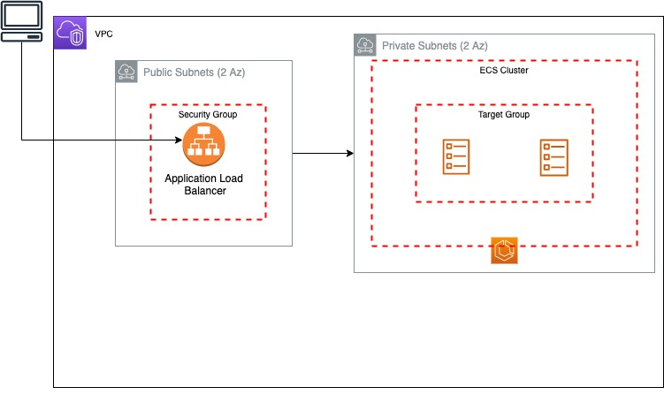

# `🎇 TIMEOFF AUTOMATION`

This project is based on the timeoff application:

https://github.com/timeoff-management/timeoff-management-application

## Diagram:

## Tools:

    Terraform:
        - Infrastructure as Code to provision resources to AWS within the tf/ folder
    Github Actions:
        -  Pipeline to build solution and deploy to AWS
        it will executed each time there is a push to master
    AWS:

        VPC
            - VPC with 2 Public Subnets (2 Az) and 2 Private Subnets (2 Az)
            - It has an internet gateway for the 2 Public Subnets
            - It has 2 NAT Gateway, to grant access to the 2 Private Subnets to internet (Each one with EIP associated)
        
        Application Load Balancer
            - COnfigured with 2 Public Subnets
            - Security Group configured
            - Listener to a Target Group configured
            - Target Group redirecting to ECS cluster
        ECS:
            - Cluster provisioned
            - Task definition
                - Used Fargate
                - Image stored in ECR
            Service
                - Configured in the Private Subnets
                - Auto Scaling: Minimum 1 - Maximum 4

## Project Status
